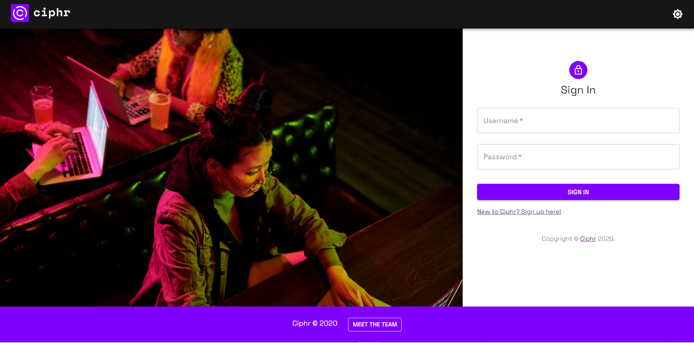
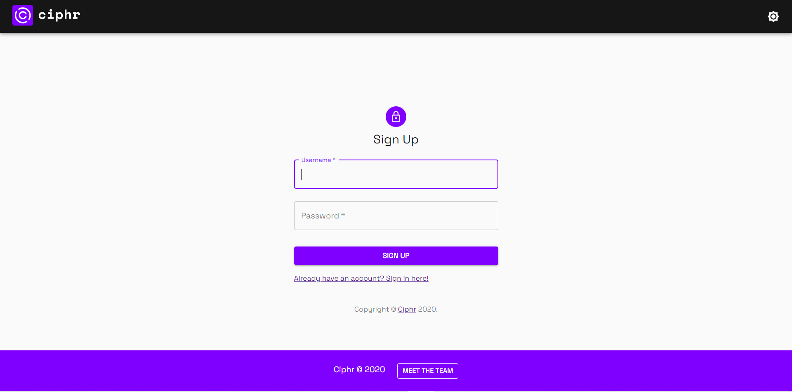
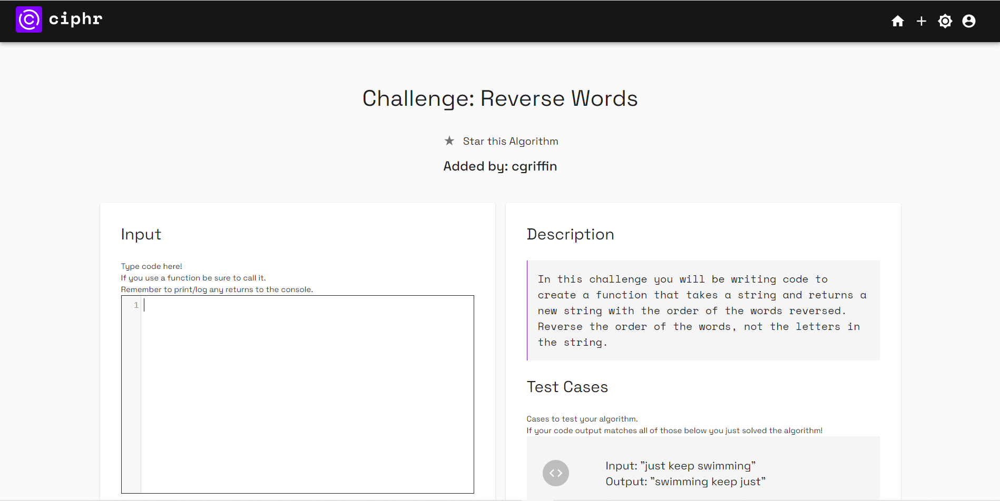
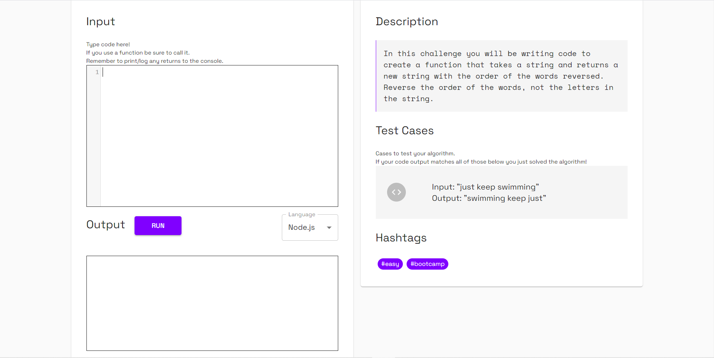
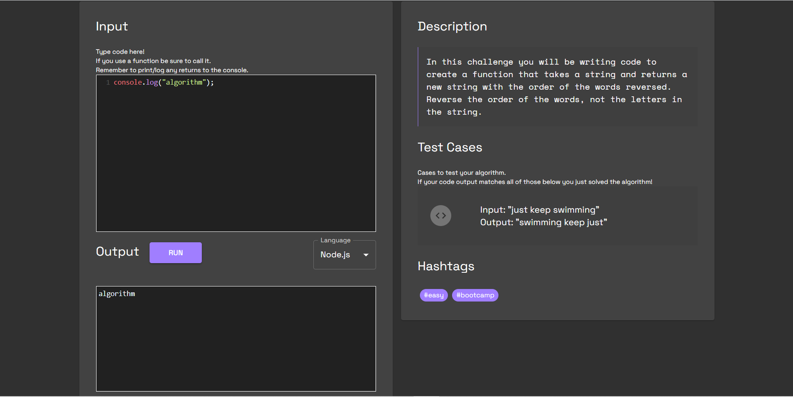
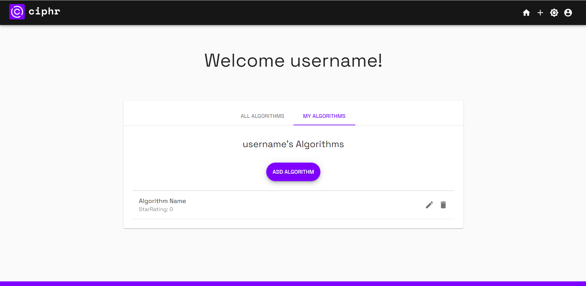
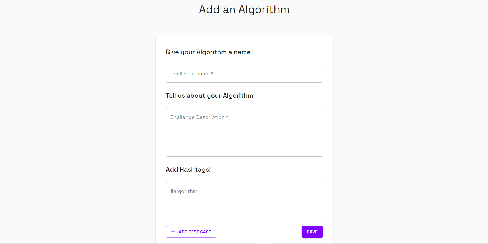
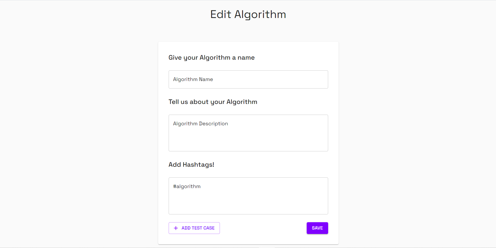
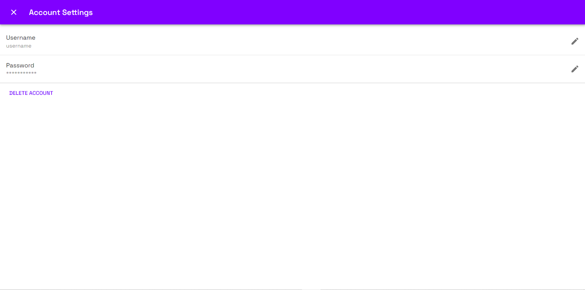

# Ciphr

## Table of Contents
* [Description](#Description)
* [Links](#Links)
* [Usage](#Usage)
* [Design Elements](#Design-Elements)
* [Collaborators](#Collaborators)
* [Future Development Ideas](#Future-Development-Ideas)
* [App Preview](#App-Preview)
* [Credits](#Credits)

## Description
This is an app that serves as a platform to share and solve coding algorithms. This website enables developers to connect with each other in order to strengthen their critical thinking abilities and problem solving skills. Ultimately, our team wants to make it easier for developers to work together in order to become better coders. Our users are developers who want to improve their skills, improve their apps, and improve their chances at securing their dream job. This is what motivates us - Building a place for developers to come together so that they can build better apps and make the world a better place.

## Links
* Website: https://ciphr.herokuapp.com/
* GitHub Repository: https://github.com/zachdrummond/ciphr

## Usage
* Create an Account
    1. On the homepage, click "New to Cipher? Sign up here!"
    2. Add a username and password and click the "Sign Up" button.

* Dark Mode
    1. Click the sun icon on any page to add a dark theme to the app.
    2. Click the moon icon on any page to add a light theme to the app.

* Solving an Algorithm
    1. On the "All Algorithms" page, click an algorithm.
    2. Read the description and test cases.
    3. Choose the language you want to use to solve the algorithm.
    4. Add your code to the input box.
    5. Click the "Run" button.
    6. If you solved the algorithm, the output in the output box should match the output provided in the test cases.
    7. Click the star if you like this algorithm.

* Adding an Algorithm
    1. Click the plus icon in the menu or on the "My Algorithms" page, click the "Add Algorithm" button.
    2. Add a name, description, and at least one hashtag for your algorithm.
    3. To add test cases, click the "Add Test Case" button. You can add up to four test cases for each algorithm.
    3. Click the "Save" button.

* Edit/Delete an Algorithm
    1. To edit one of your algorithms, click the pencil icon on the "My Algorithms" page. Then update your algorithm and click the "Save" button.
    2. TO delete one of your algorithms, click the delete icon on the "My Algorithms" page.

* Account Features
    1. Click the person icon in the menu.
    2. To logout, click the "Logout" button.
    3. To edit or delete your account information, click the "My Account" button.
    4. To edit your username or password, click the pencil icon. Enter your new username or password then click the "Save" button.
    5. To delete your account, click the "Delete Account" button. Then click the "Delete" button.

## Design Elements
### _Technologies_
* Code Mirror
* Paiza.io
* Material UI
### _Front End_
* JavaScript
* React.js
* CSS
### _Back End_
* JavaScript
* Node.js
* Express.js
* Mongoose.js
* MongoDB

## Collaborators
* Zach Drummond - https://github.com/zachdrummond
* Calvin Griffin - https://github.com/cgriffin332
* Joseph Perry - https://github.com/dgtlctzn
* Andrew Stewart - https://github.com/stewdiostash

## Future Development Ideas
* Categories for Algorithms - i.e. Trending
* User Collections for Algorithms
* Discussion Board
* Reward System for Adding and/or Solving Algorithms
* Rating System for Algorithm Level of Difficulty
* Solutions for Algorithms
* Testing the Output based on the Solution and displaying a Success/Error Message
* Sharing Algorithms on Social Media

## App Preview
### *Login*

### *Sign Up*

### *All Algorithms*

### *Challenge*

### *My Algorithms*

### *Add/Edit an Algorithm*

### *Account*

## Credits
* https://www.heroku.com/
* https://reactjs.org/
* https://reactrouter.com/
* https://paiza.io/en
* https://codemirror.net/
* https://material-ui.com/
* https://www.mongodb.com/
* https://nodejs.org/en/
* http://expressjs.com/
* https://mongoosejs.com/
* https://www.npmjs.com/
* https://www.npmjs.com/package/axios
* https://www.npmjs.com/package/bcrypt
* https://www.npmjs.com/package/dotenv
* https://www.npmjs.com/package/if-env
* https://www.npmjs.com/package/jsonwebtoken
* https://www.npmjs.com/package/nodemon
* https://www.npmjs.com/package/path
* https://www.npmjs.com/package/concurrently